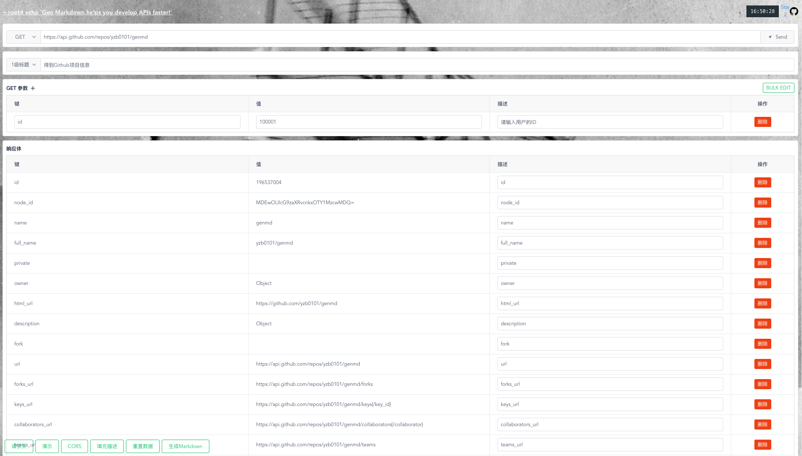

# Gen Markdown



[简体中文](README.zh-CN.md)

## Project setup

```
yarn
```

### Compiles and hot-reloads for development

```
yarn dev
```

### Compiles and minifies for production
```
yarn build
```

### Run your tests
```
yarn  test
```

### Lints and fixes files
```
yarn lint
```